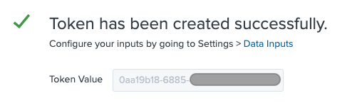

## Amazon GuardDuty to Splunk Enterprise Demo
The purpose of this repository is to demo how to ingest Amazon GuardDuty findings into Splunk Enterprise.

AWS CloudFormation template (main.yaml) will deploy Splunk Enterprise and [Splunk GuardDuty Processor AWS Lambda Function](https://github.com/splunk/splunk-aws-serverless-apps/tree/master/splunk-guardduty-processor).

#### Requirements
  - Splunk Enterprise subscription in [AWS Marketplace](https://aws.amazon.com/marketplace/pp/B00PUXWXNE)

###  Launch the AWS CloudFormation Stack

Click on the **Launch Stack** button below to launch the CloudFormation Stack to set up the Amazon GuardDuty to Splunk Demo in the region of your preference, by default this demo will be deployed in us-west-2 (Oregon) region.

[](https://us-west-2.console.aws.amazon.com/cloudformation/home?region=us-west-2#/stacks/quickcreate?templateUrl=https%3A%2F%2Famazon-guardduty-to-splunk.s3-us-west-2.amazonaws.com%2Fmain.yaml&stackName=amazon-guardduty-to-splunk-demo&param_AllowedIP=0.0.0.0%2F0&param_PublicSubnet1CIDR=10.10.10.0%2F24&param_PublicSubnet2CIDR=10.10.11.0%2F24&param_SplunkAmiId=ami-0f7a62ef867109fe1&param_VpcCIDR=10.10.0.0%2F16)

Provide a stack name eg **amazon-guardduty-to-splunk-demo**.

You can launch the same stack using the AWS CLI. Here's an example:

```
aws cloudformation create-stack --stack-name amazon-guardduty-to-splunk-demo \
   --template-body file://main.yaml \
   --capabilities CAPABILITY_IAM
```

### Accessing Splunk Enterprise
Once stack creation is completed, it will output the **Splunk DNS Name**, **Username** and **Password** under "Outputs" tab of your stack.


### Enable HTTP Event Collector on Splunk Enterprise
- Settings > Data Inputs
- Click HTTP Event Collector
- Click Global Settings
- Disable SSL (for Demo Purposes, in production environments keep SSL enabled)
- Click Save


### Create an Event Collector token
- Click New Token
- Give it a Name (such as **splunk-guardduty-processor-token**)
- Click Next
- Leave everything as default
- Click Review and Submit
- Copy your Token Value



### Replace HTTP Event Collector Token in your Lambda Function
- Go to your [Lambda Function](https://us-west-2.console.aws.amazon.com/lambda/home?region=us-west-2#/functions/SplunkGuardDutyProcessorFunction?tab=configuration)
- Under Environment variables replace the value of SPLUNK_HEC_TOKEN key with your token.


### Generate Sample Findings
Now it is time to generate some Amazon GuardDuty Findings using "Generate sample findings" button on [Settings page](https://us-west-2.console.aws.amazon.com/guardduty/home?region=us-west-2#/settings).

Findings are automatically sent to CloudWatch Events, please wait few minutes to see the findings in Splunk.

### Search in Splunk Enterprise
Go to Splunk search and write "*" as in the following image to search all messages in all indexes.


###  Clean up
After completing your demo, delete AWS CloudFormation Stack using AWS Console or AWS CLI:

```
aws cloudformation delete-stack --stack-name amazon-guardduty-to-splunk-demo
```

## Security

See [CONTRIBUTING](CONTRIBUTING.md#security-issue-notifications) for more information.

## License

This library is licensed under the MIT-0 License. See the LICENSE file.
